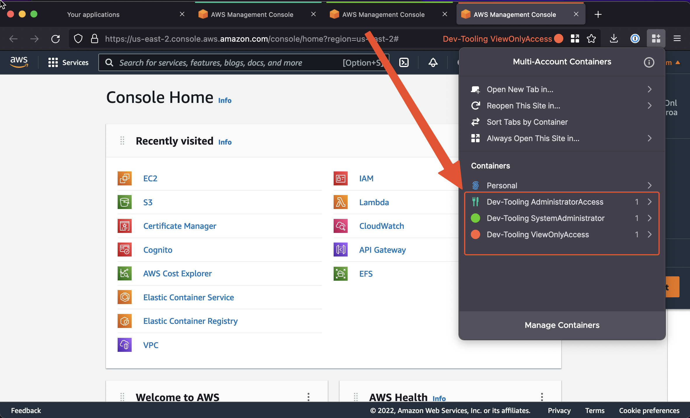
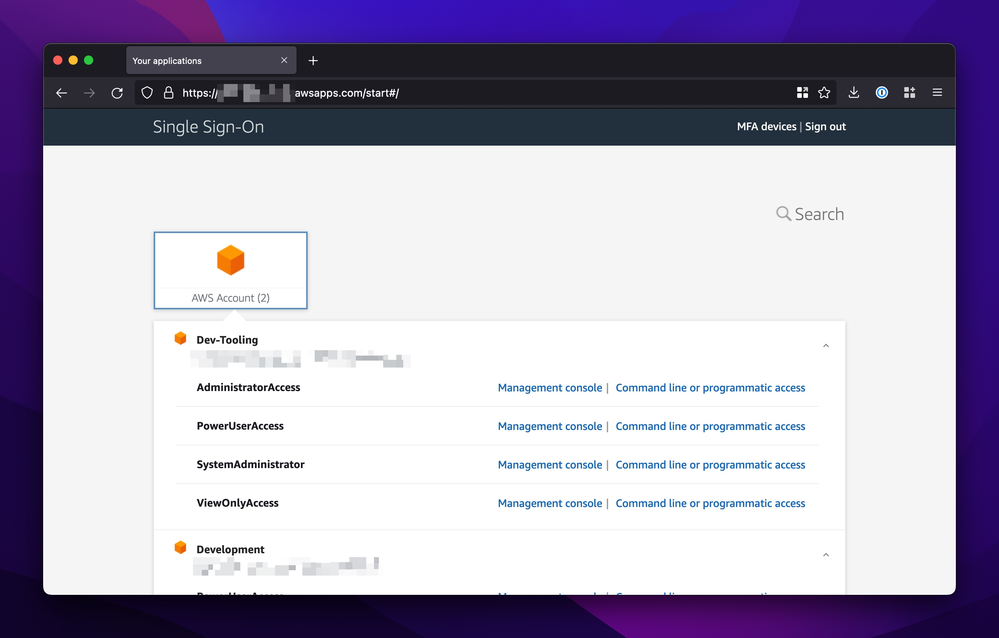
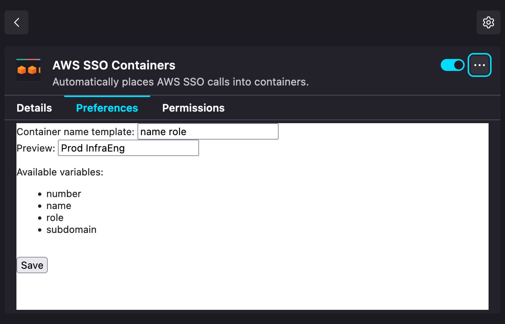
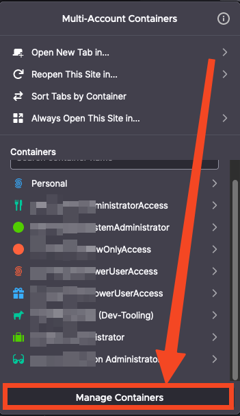

# AWS SSO Containers

This Firefox extension routes [AWS SSO](https://aws.amazon.com/single-sign-on/) requests into their own containers so you can log in to multiple accounts/roles simultaneously.

## How It Works

When you click on "Management console" for any account/role in AWS SSO, it makes a request for signing tokens and then redirects you to the federation location. The extension intercepts this request and loads the federation location in a container. Container names are `<ACCOUNT_NAME> <ROLE_NAME>` and are assigned a random color/icon. You can change the colors/icons to whatever you like, as it only uses the container name to reference them.

## FAQs

### Can I change what the containers are named?

Containers are referenced via their name when determining where SSO calls should be routed. In order to change what template is used, open the extension preferences

### Can I change what icons and colors are used for containers?

Colors and icons are randomly selected when spawning a new container for the first time. Going forward it is referenced via its name, and so you can change the icon and color by using the built-in "Manage Containers" feature in Firefox.

## Notes

This extension is pretty basic. If you're looking for something more advanced, check out [Granted](https://docs.commonfate.io/granted/introduction).

Thanks to <https://github.com/honsiorovskyi/open-url-in-container> for a majority of the container code.